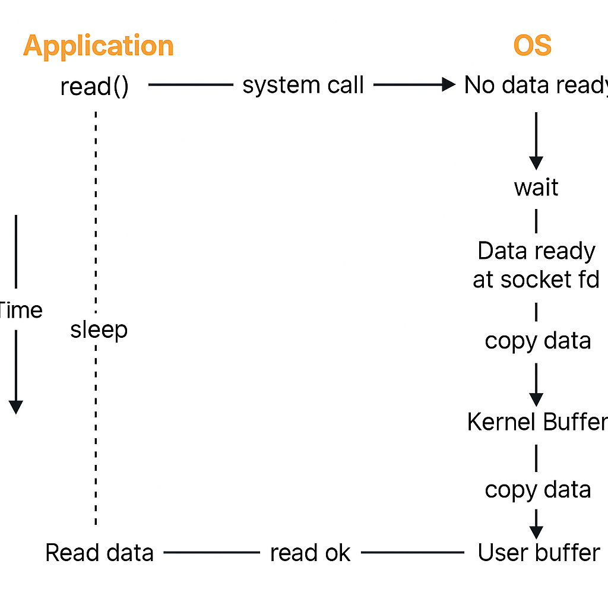
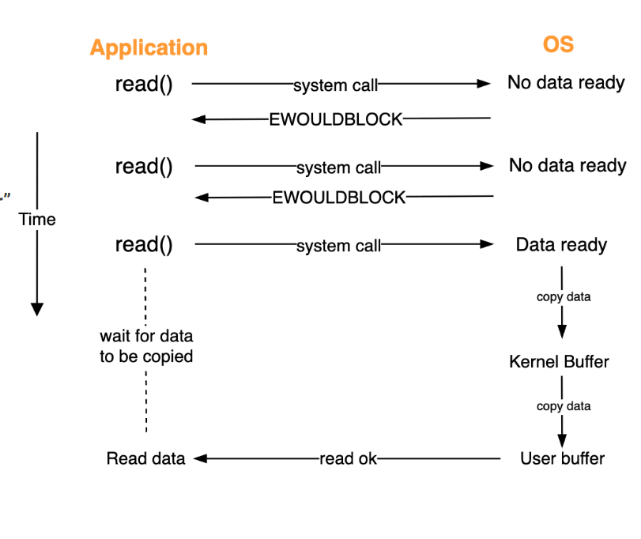
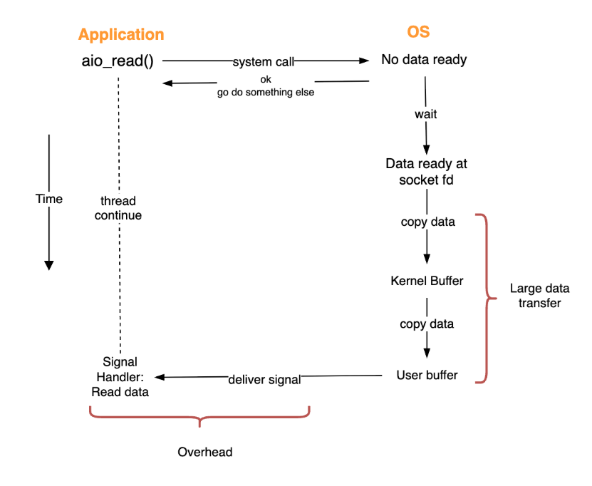
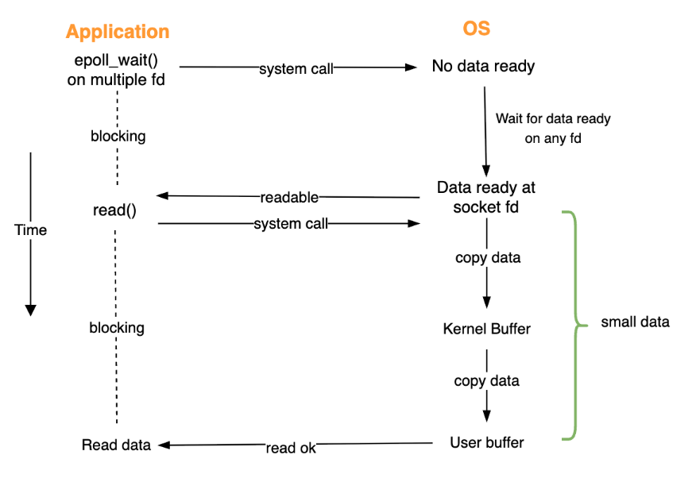
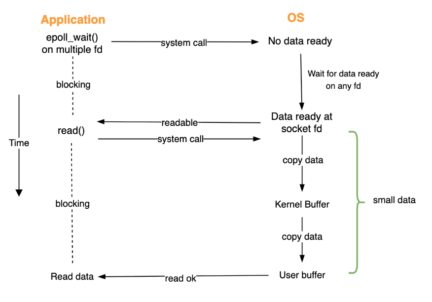

## Everything is a file
- a file  == a stream of bytes
- Everything: file, directory, socket, device file
- Everything in a computer software can be represented of as a stream of bytes

### why is it helpful?
- Simple and consistent interface to manage different resource (biểu diễn tất cả mọi thay đổi trong 1 file)
- Abstraction: abstract away the complex, low-level details of hardware interaction (dấu đi tất cả các low-level)
- Unified, reusable tools: cat, grep, awk, seq
- Unified namespace: Many resources are represented as entries in the hierarchical filesystem (mỗi file biểu diễn cho 1 resource)
- * tùy vào đối tượng mà file này biểu diễn thì nó sẽ ở trên ram or hard-disk

### File descriptor
- là 1 số nguyên biểu diễn 1 file đang được mở bởi OS (id của file đuược được mở)
- mỗi process sẽ có 1 tập hợp FD của nó( các process có thể có trùng FB )
- là 1 interface để process có thể đọc/ghi

```
fb = create("hello.txt", 777)
write(fb, "hi", 2)
```

```go
listener, err := net.Listen("tcp", 3000)
conn, err := listener.Accept()
// conn là File descriptor của file biểu diễn socket 
```

## IO models
- Reading data from network socket
  - 1. Data arrived from network to kernel buffer
  - 2. Switch mode and copy data from Kernel buffer to User buffer
  - read data -> [Port] -> [Kernel Space] -> [System call(API) -> Switch context and copy] -> [User space]
  - tại sao lại cần bước copy -> vấn đề bảo mật (không cho ứng dụng của user-space đi thẳng đến kernel-space)


### Blocking IO




### Non-Blocking IO



- If haven't the data, try again later
- need to keep asking ( hỏi lại liên tục )

### Async IO


- pros: 
  - truly async
  - disk I/O, large file transfer scenarios with long I/O latency
- cons:
  - overhead for small data

### IO Multiplexing

- Idea : use 1 thread to manage multiple connections simultaneously without getting blocked






#### Linux System calls
- epoll_create(): create an epoll instance, return epoll FD
- epoll_ctr(): add/remove a FD to the monitoring list
- epoll_wait(): wait and return FDs that are ready for IO

#### MacOS System calls