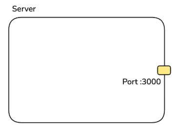
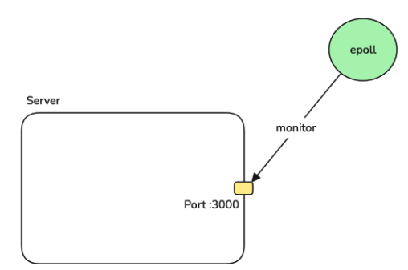
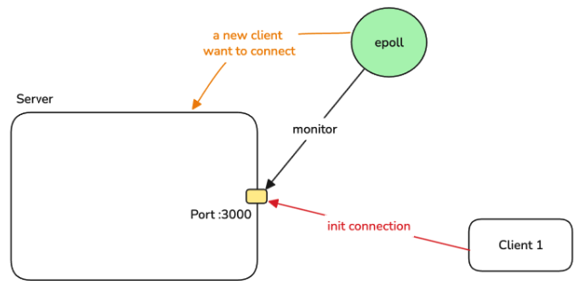
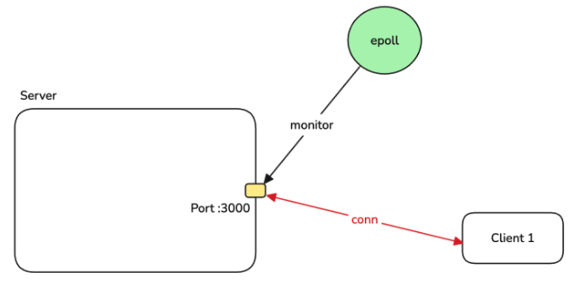
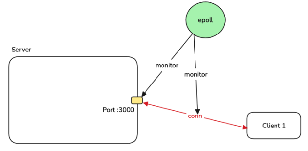
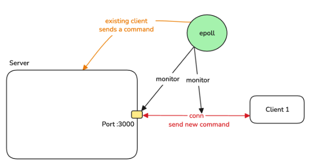
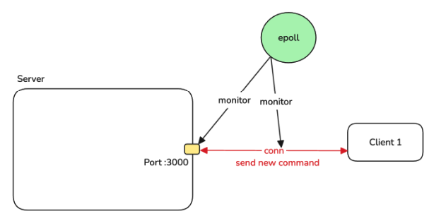

## Implement I/O Multiplexing

- Step 1: Create Listener FD that listens to port 3000


- Step 2: Create an epoll instance and let it monitor Listener FD



- Step 3: 2 sitiations:

1. A new client wants to make a TCP connection to server

- Epoll notifies Server


- Create a new connection


- Add connect to the monitoring list of epoll


2. Existing client sends a new command to Server

- Epoll notifies Server


- Server read from the connection
- Server process the command
- Server replies client



- Client connect đến port 3000, epoll notify server accept. Sau khi server accept thì socket được tạo và đăng kí với poll để lắng nghe. Khi client gửi dữ liệu, dữ liệu được ghi vào socket -> epoll notify server -> server xử lý rồi ghi vào socket để trả về. 

- Khi ngắt kết nối -> socket bị xóa -> epoll remove ? 


## Benmark

./redis/src/redis-benchmark -n 10000 -t ping_mbulk -c 200 -h localhost -p 3000

TCP Server with thread-per-connection + blocking IO:

Summary:
  throughput summary: 69444.45 requests per second
  latency summary (msec):
          avg       min       p50       p95       p99       max
        2.335     0.048     1.863     4.695    10.183    15.247


IO Multiplexing:

Summary:
  throughput summary: 84745.77 requests per second
  latency summary (msec):
          avg       min       p50       p95       p99       max
        1.437     0.344     1.063     3.591     5.959     6.823


## RESP
- RESP là protocol phục vụ cho Redis client giao tiếp với Redis server
- Reliable (vì là build on top of TCP)
- Simple to implement
- Fast to parse
- Human-readable

- Support different types of data:
  - string
  - array
  - integer, double
  - boolean
  - error
  - ...

### Simple String
- Start with `+`
- Followed by string
- Followed by `\r\n`
- Cant contant `\r\n`

- len(s) + 3 bytes

Example:
- "hello" -> +hello\r\n
- "hello+" -> +hello+\r\n

### Bulk String
- The dollar sign `$` as the first byte
- One or more decimal digits (0..9) as the string's length, in bytes, as an unsigned, base-10 values
- The CRLF terminator
- The data
- A final CRLF

`$<length>\r\n<data>\r\n`

Example:
- "hello" -> $5\r\nhello\r\n
- "" -> $0\r\n\r\n
- Null value -> $-1\r\n

### Integer
- Start with `:`
- Followed by the integer
- Followed by `\r\n`

`:[<+|->]<value>\r\n`

Example:
- 1234 -> :1234\r\n
- -10 -> :-10\r\n


### Array
- An asterisk (*) as the first byte
- One or more decimal digits(0..9) as the number of elements in the array as an unsigned, base-10 value
- The CRLF terminator
- An additional RESP type for every elememnt of the array

Example:
- ["hello", 10, "world"] -> *3\r\n$5\r\nhello\r\n:10\r\n$5\r\nworld\r\n
- empty array -> *0\r\n
- null array *-1\r\n

### Error
- Start with "-"
- Follow by message
- Follow by CRLF "\r\n"

Example:
- key not found\r\n

## Q/A
- RESP balance giữa readable với high performance vậy ạ. Tại sao json cũng readable nhưng mà performance lại kém vậy ạ

```
"hello" =>
{\r\n
    type: 0,
    value: "hello"
}
```
```
"hello" => +hello\r\n
```

=> trông rất cồng cành và tốn resource(nhiều byte hơn so với RESP) 
- 